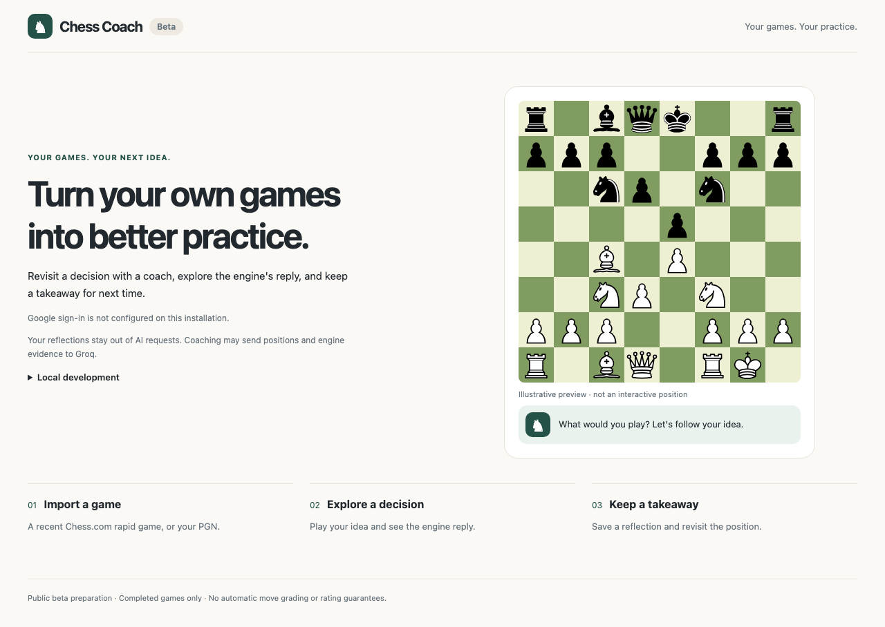

# Chess Coach

Practice decisions from your own games: sign in → choose a completed game → analyze → play through a position → optionally save a reflection.

Flask, Python, Stockfish and SQLite. The coach plays an engine-supported opponent reply; **Self analysis** lets you play both sides. Best-move arrows start off. The evaluation bar always uses White's perspective.



## Status

Local beta. Automated tests, real-engine checks and browser interactions pass; see [validation](docs/VALIDATION.md) for exact environments and pending release gates. The source is published on GitHub with passing CI. Public deployment and two-account live sign-in verification remain pending. Public AI commentary is disabled; board-derived coaching works without a provider.

## Run locally

Install Python 3.13+ and Stockfish, then:

```sh
python3 -m venv .venv
.venv/bin/python -m pip install -r requirements.txt
export APP_ORIGIN=http://127.0.0.1:5050
export LOCAL_DEMO=1 LOCAL_TESTING=1 AUTOMATIC_EXERCISES_ENABLED=1
export WALKTHROUGH_AI_ENABLED=0
# If Stockfish is not on PATH:
# export STOCKFISH_PATH=/absolute/path/to/stockfish
.venv/bin/python -m flask --app 'chess_coach.beta:create_app()' run --host 127.0.0.1 --port 5050
```

Open [localhost:5050](http://127.0.0.1:5050), expand **Local development**, and enter the demo. Import recent rapid games, browse a past archive month, or paste `tests/fixtures/rapid-white.pgn`. Choose a game and practice an analyzed position. The local flags are for evaluation and are rejected on public origins.

The database lives in `instance/chess-coach.sqlite3`. Preserve it and set a persistent random `SECRET_KEY` when using real sign-in. `.env` is not loaded automatically: use `set -a; source .env; set +a` with your own trusted configuration. Never commit credentials or databases. See [Google setup](docs/CREDENTIAL_SETUP.md) and [Railway, Docker and backup instructions](docs/DEPLOYMENT.md).

## Verify

```sh
.venv/bin/python -m pip install -r requirements-dev.txt
.venv/bin/python -m playwright install chromium
env RUN_STOCKFISH_TESTS=1 RUN_BROWSER_TESTS=1 .venv/bin/python -m unittest discover -s tests -v
node --check chess_coach/static/practice.js
```

CI runs the suite with Python 3.13, Stockfish and Chromium. Browser tests use anonymized game fixtures, temporary accounts and a fixed import response; they do not prove live Google/Chess.com integration. Recordings and test databases remain ignored.

## Behavior and limitations

- Recent import is bounded to 100 rated standard rapid games over 90 days. Archive browsing supports individual months and result/time-control filters; it does not automatically analyze your history.
- Analysis inspects at most eight candidates and retains at most three stable positions. Selection requires ≥150 centipawn loss in two searches, the same recommendation, and recommended evaluation ≥−200 from the player's perspective. Mate candidates are excluded.
- Lines and short-search evaluations are approximate. Matching an example is encouraging feedback, not proof that every other legal move is wrong. No rating improvement or diagnosed weakness is claimed.
- **Practiced** means a position has a non-deleted saved attempt. Repeat saves do not inflate progress. Reflections are optional and stored separately from engine exploration.
- Saved attempts reference immutable exercise versions. Submission IDs make retries safe; ownership checks protect personal resources. These safeguards have targeted tests, not an independent security audit.
- One instance, one Gunicorn process and one supervised engine subprocess. SQLite, queue limits and daily quotas bound the beta. Unsaved drafts disappear on reload; backups require operational care.
- Optional Groq commentary sends bounded position evidence, excluding identity and reflections. Structured validation cannot prove chess accuracy, so public AI remains off until its quality gate passes.

## Project documentation

[Architecture](docs/ARCHITECTURE.md) · [Validation](docs/VALIDATION.md) · [Teaching review](docs/TEACHING_REVIEW.md) · [Deployment](docs/DEPLOYMENT.md) · [UI customization](docs/UI_CUSTOMIZATION.md) · [Two-minute explanation and resume bullets](docs/PORTFOLIO.md).

The CLI and offline examples remain development utilities; [prototype instructions](docs/LOCAL_GUIDE.md) describe them. Examples and tests are excluded from the production image.

## License

GPL-3.0-or-later. See [LICENSE](LICENSE), [NOTICE](NOTICE) and [dependency notices](docs/DEPENDENCIES.md). Docker retains the exact Debian Stockfish package version, license notices and corresponding source archives under `/app/notices/stockfish`.
